# Blueprint - Intermediate - Offline device monitor

**Difficulty:** Intermediate

**Estimated Time:** 30 minutes

**Hardware Needed:** None

---

### Overview

This blueprint will use a periodic Logic function to send an alert event when a device is offline for longer than a pre-defined period.

---

### Tools & Materials

- Particle device (Photon 2, Boron, etc.)
- USB cable
- Optional sensors or components
- Particle Workbench or CLI installed

---

### Prerequisites

- Particle account and claimed device
- Firmware flashing familiarity
- Basic understanding of Publish / Function concepts

---

### Steps

1. **Clone this repository:**

   ```bash
   git clone https://github.com/particle-iot/blueprint-intermediate-temperature-ledger.git
   cd blueprint-intermediate-temperature-ledger
   ```

2. **Open the project** in Particle Workbench or your preferred editor.

3. **Flash to your device:**

   1. Configure project for your device using Particle Workbench and the command pallette (cmd / ctrl + shift + p):
      
   2. Select your device model and Device OS release:
      
      

4. **Create the Ledger instance**

   1. Navigate to the "Ledger" cloud service:
      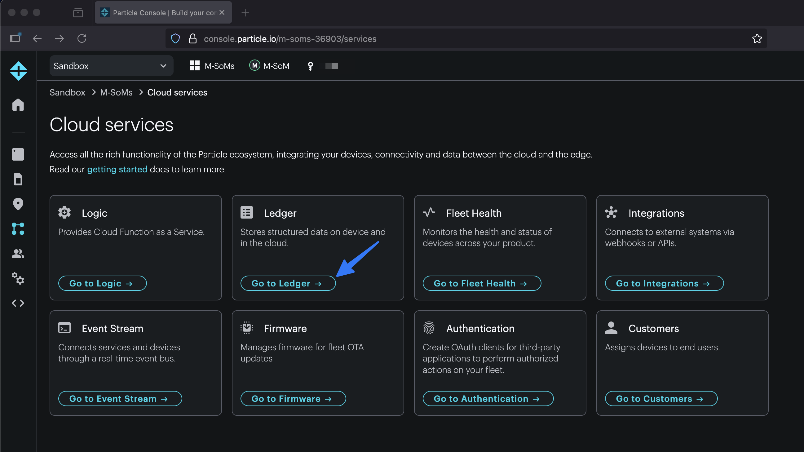
   2. Create a new Cloud Ledger:
      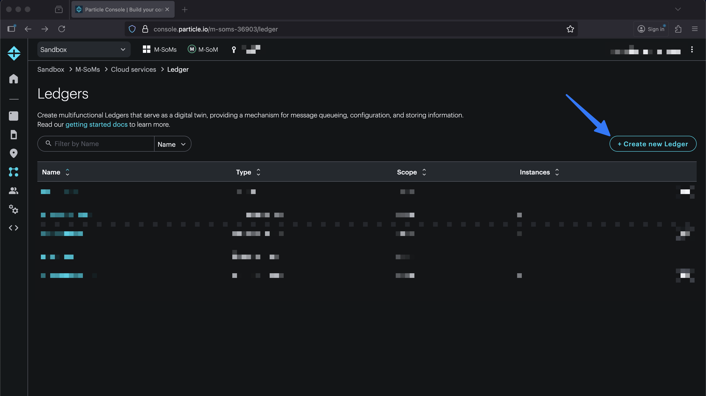
      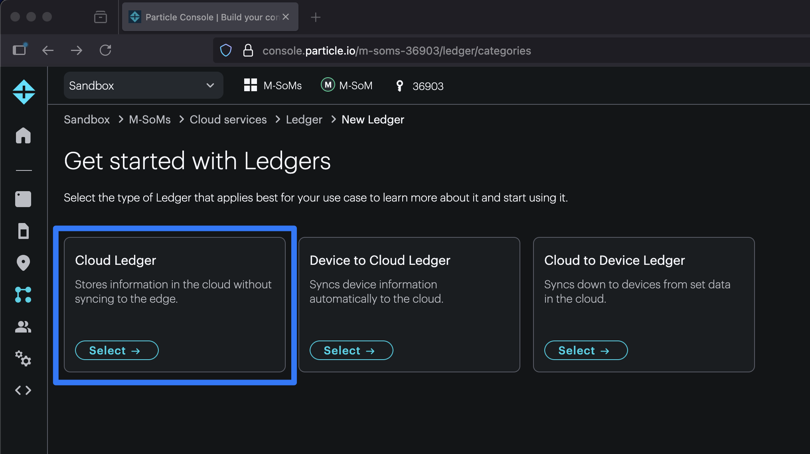
   3. Give the Ledger a name and choose the "Product" level scope. Make note of this name as it will have to be passed into the Logic function. In this case, we're choosing `offline-devices`. But, it can be anything as long as it's also correctly defined in the Logic function code.
      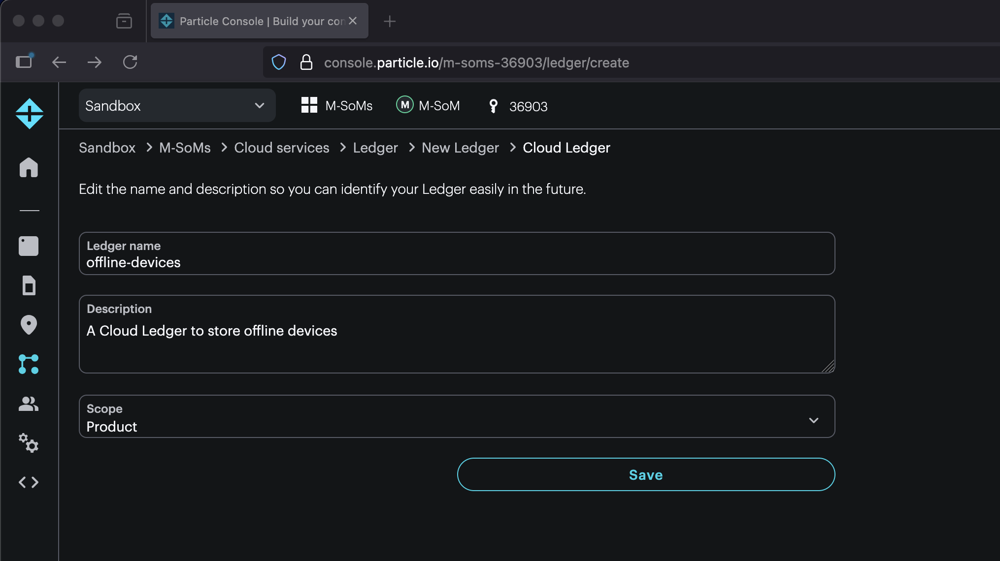

5. **Create an API user**

   1. Navigate to "Teams" and create a new API user:
      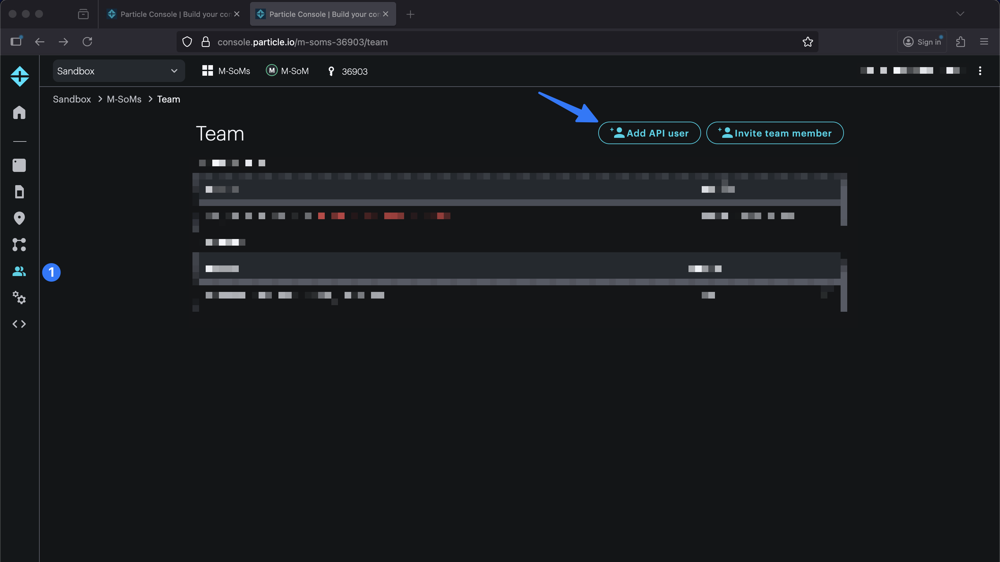
   2. Name the API user and select the required scopes: `Devices`, `Product`, and `Ledger`:
      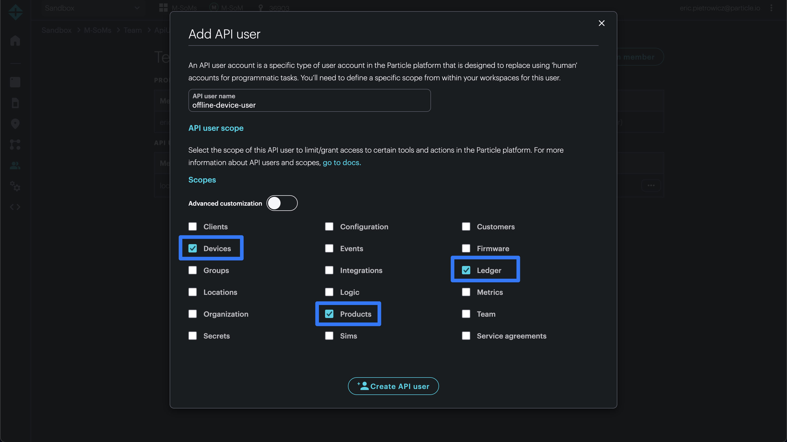
   3. Store the API user's credentials:
      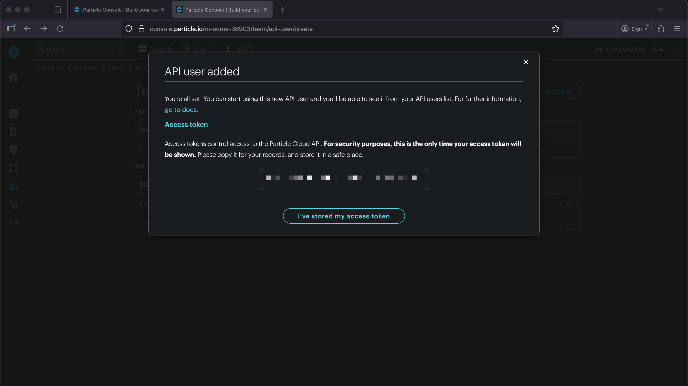

6. **Create the Logic function**

   1. Navigate to the "Logic" cloud service:
      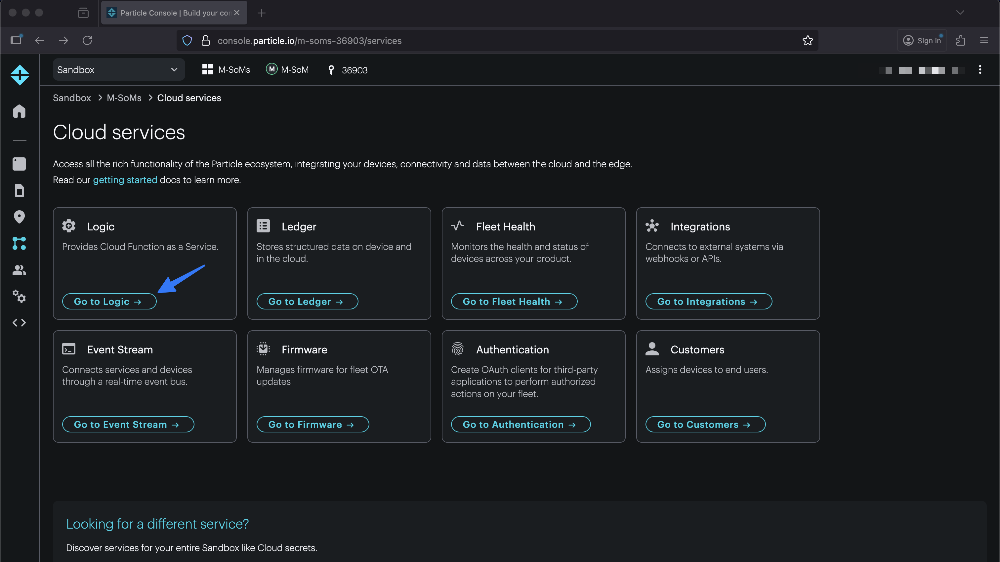
   2. Select "Start with template":
      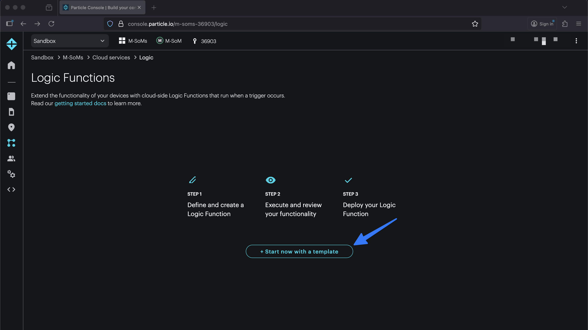
   3. Choose the "Scheduled Function" template:
      
   4. Enter a name and description for your scheduled Logic function:
      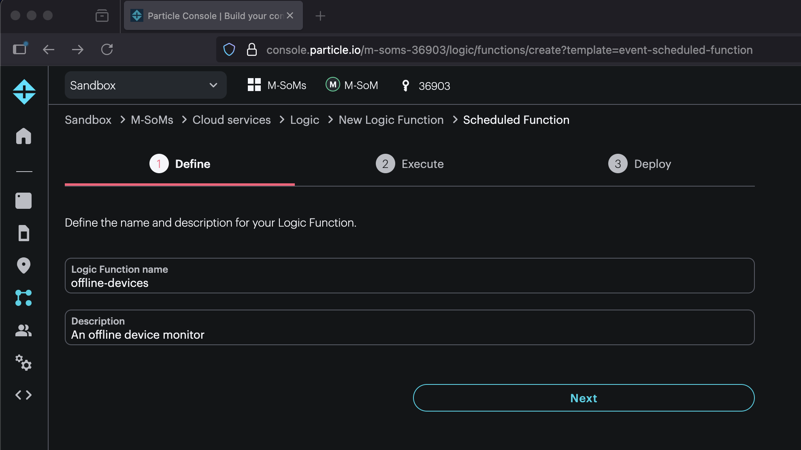
   5. Paste in the following Javascript code making sure to update `LEDGER_NAME` with the name of your offline device Ledger created in a previous step. This code can also be found in `logic-function.js`.
      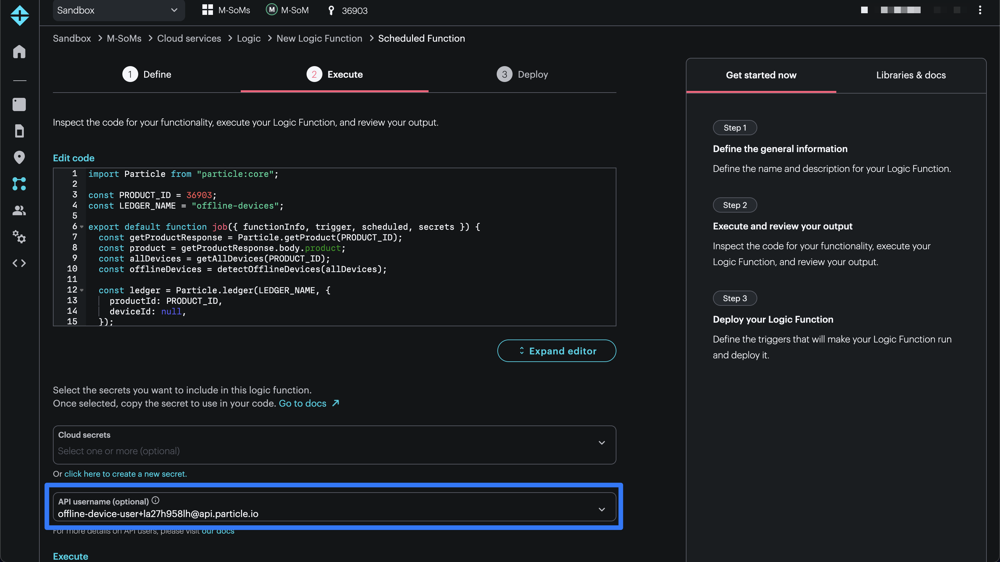

      ```js
      import Particle from "particle:core";

      const PRODUCT_ID = 36903;
      const LEDGER_NAME = "offline-devices";

      export default function job({
        functionInfo,
        trigger,
        scheduled,
        secrets,
      }) {
        const allDevices = getAllDevices(PRODUCT_ID);
        const offlineDevices = detectOfflineDevices(allDevices);

        const ledger = Particle.ledger(LEDGER_NAME, {
          productId: PRODUCT_ID,
          deviceId: null,
        });
        const ledgerState = ledger.get().data;

        const newlyOfflineDevices = filterNewOfflineDevices(
          offlineDevices,
          ledgerState
        );

        if (newlyOfflineDevices.length > 0) {
          console.log("offline devices: ", newlyOfflineDevices);
          Particle.publish("offline-device-alert", newlyOfflineDevices, {
            productId: PRODUCT_ID,
          });
        }

        ledger.set(
          {
            offlineDevices: offlineDevices.map((device) => device.id),
          },
          Particle.REPLACE
        );
      }

      function getAllDevices(productId) {
        const allDevices = [];
        let page = 1;
        let perPage = 25;

        while (true) {
          const response = Particle.listDevices(productId, { page, perPage });
          allDevices.push(...response.body.devices);
          if (response.body.devices.length < perPage) {
            break;
          }
          page++;
        }
        return allDevices;
      }

      function detectOfflineDevices(devices) {
        return devices.filter((device) => {
          const timeSinceLastHeard =
            new Date() - new Date(device.last_heard).getTime();
          const isOffline = timeSinceLastHeard >= 60 * 60 * 1000; // 60 minutes
          return !device.connected && isOffline;
        });
      }

      function filterNewOfflineDevices(offlineDevices, previousState) {
        if (
          !previousState.offlineDevices ||
          previousState.offlineDevices.length === 0
        ) {
          return offlineDevices;
        }
        return offlineDevices.filter(
          (device) => !previousState.offlineDevices.includes(device.id)
        );
      }
      ```

   6. Define a schedule for your Logic function:
      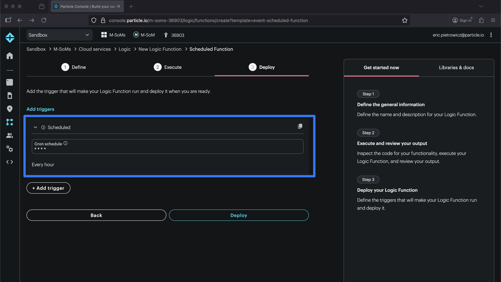

---

### How It Works

The device firmware for this blueprint just contains template code as the scheduled Logic function will do all of the monitoring. The example describes a function that runs every 60 minutes that queries an entire product for any device who's `last_heard` timestamp is greater than 60 minutes. This should be greater than 45 minutes as sometimes cellular devices can be disconnected from the cloud service for at least this long without anything inherently being wrong.

The Logic function can be broken down into a number of subsections. First, the `PRODUCT_ID` and `LEDGER_NAME` are defined at the top of the file. You can find the `PRODUCT_ID` in the "product" view of the console.

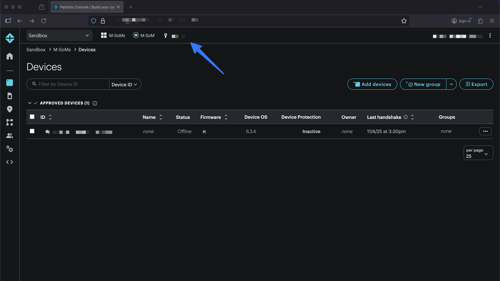

The `LEDGER_NAME` should be the same value provided in the Ledger creation step.

Next, all devices in the product are fetched using a pagenated approach:

```js
function getAllDevices(productId) {
  const allDevices = [];
  let page = 1;
  let perPage = 25;

  while (true) {
    const response = Particle.listDevices(productId, { page, perPage });
    allDevices.push(...response.body.devices);
    if (response.body.devices.length < perPage) {
      break;
    }
    page++;
  }
  return allDevices;
}
```

These devices are passed into a function that compares any device who has a `last_heard` timestamp that is greater than 60 minutes ago. Note that for cellular devices, this threshold should be at least 45 minutes.

```js
function detectOfflineDevices(devices) {
  return devices.filter((device) => {
    const timeSinceLastHeard =
      new Date() - new Date(device.last_heard).getTime();
    const isOffline = timeSinceLastHeard >= 60 * 60 * 1000; // 60 minutes
    return !device.connected && isOffline;
  });
}
```

The Ledger instance containing any currently known offline devices is fetched. This is done to prevent any offline devices from alerting on each Logic function run.

```js
const ledger = Particle.ledger(LEDGER_NAME, {
  productId: PRODUCT_ID,
  deviceId: null,
});
const ledgerState = ledger.get().data;
```

The `newlyOfflineDevices` are calculated based on the existing Ledger state and the currently `offlineDevices`.

```js
function filterNewOfflineDevices(offlineDevices, previousState) {
  if (
    !previousState.offlineDevices ||
    previousState.offlineDevices.length === 0
  ) {
    return offlineDevices;
  }
  return offlineDevices.filter(
    (device) => !previousState.offlineDevices.includes(device.id)
  );
}
```

If any devices are newly offline, a `Particle.publish` to the `offline-device-alert` event stream is executed. The intention is there is a downstream integration that listens to the `offline-device-alert` event stream to trigger a notification of some sort. You might consider a Slack, Pager Duty, or Twilio SMS integration.

```js
if (newlyOfflineDevices.length > 0) {
  console.log("offline devices: ", newlyOfflineDevices);
  Particle.publish("offline-device-alert", newlyOfflineDevices, {
    productId: PRODUCT_ID,
  });
}
```

Finally, the Ledger instance gets updated with the known offline devices so the next run of the Logic function won't trigger an alert for an existing offline device.

```js
ledger.set(
  {
    offlineDevices: offlineDevices.map((device) => device.id),
  },
  Particle.REPLACE
);
```

---

### Usage

You can test that the monitor is working with the following steps:

1. Make sure there is an offline device in your product.
2. Confirm that the device ID **doesn't exist** in the `offline-device-ledger`. Delete it if so.
3. Manually re-run the scheduled Logic function and confirm that an `offline-device-alert` event is generated and the Ledger instance is updated with the offline device ID.

---

### Topics Covered

- `Logic`
- `Ledger`

---

### Extensions

Create an integration that is triggered on the `offline-device-alert` event. This might include a Twilio SMS, Slack, or Pager Duty integration to alert of offline devices.
